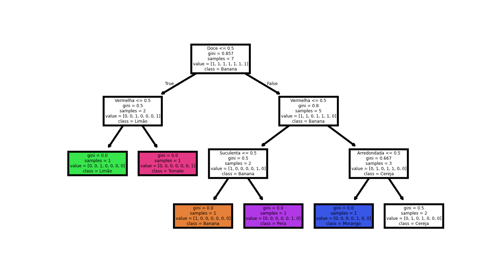

machine-learning-introduction
Learning how machine learning works. Here in this simple code, but with great information and personal advancements, is a creation of an algorithm that will learn how to "think" through the database I am implementing. Besides this code, there will be more others for consolidating the knowledge and my progress. 

this image should appear when running the file frutas.py

